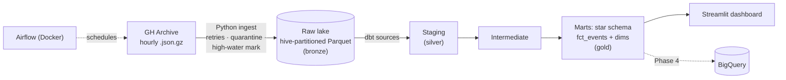

# OSS Pulse

**Which open-source ecosystems are gaining or losing contributor momentum — and is
activity concentrating in a few big repos?**

An end-to-end batch ELT pipeline over [GH Archive](https://www.gharchive.org/) — the
public firehose of every GitHub event (pushes, pull requests, issues, stars, forks,
releases), published as one gzipped NDJSON file per UTC hour, millions of events per day.

> **Status: Phase 1 of 5** — ingestion to the raw lake is built and tested.
> Coming next: dbt models (2), Airflow orchestration (3), BigQuery + CI dbt tests (4),
> Streamlit dashboard + final polish (5).

## Architecture



Warehouse: **DuckDB** locally for development, **BigQuery sandbox** for the cloud
deployment (Phase 4).

## Quickstart

```bash
pip install -e ".[dev]"

# Incremental ingest: picks up after the last ingested hour (or the last ~3 hours
# on a first run) and stops at the newest published file
python -m oss_pulse.ingest

# Explicit backfill of a range of UTC hours (inclusive)
python -m oss_pulse.ingest --start 2026-07-01T00 --end 2026-07-01T23

# Lint and unit tests (same as CI)
ruff check . && pytest -q
```

Raw data lands in `data/raw/gharchive/events/event_date=YYYY-MM-DD/event_hour=HH/`,
malformed records in `data/quarantine/`, and the incremental high-water mark in
`data/state/ingest_state.json`.

## Design decisions & tradeoffs (so far)

**Typed bronze instead of pure raw.** GH Archive is ~4–5 GB compressed *per day*.
Landing it untouched would exceed the BigQuery sandbox's 10 GB free storage within
days. At ingest we filter to the 7 event types the marts need and project ~18
explicitly-typed columns into Parquet (zstd), shrinking the lake by roughly 50×.
Tradeoff: we can't replay analyses that need unprojected payload fields without
re-downloading — acceptable because GH Archive itself is a durable, replayable
archive. At 100× budget, we'd land full raw JSON in object storage and project later.

**Idempotency via deterministic partitions.** Each UTC hour maps to exactly one
output path. Re-running an hour atomically overwrites the same file — duplicate runs
cannot duplicate data. The high-water mark advances only after an hour's Parquet is
durably in place.

**Fail loudly, quarantine the rest.** Undecodable or structurally invalid records go
to a quarantine area with the failure reason and source location — never silently
dropped, never allowed to corrupt downstream models.

**Hand-rolled retries with exponential backoff + jitter** (2s → 16s) instead of a
retry library: ~20 lines, zero dependencies, every behavior explicit. A 404 is *not*
retried — it means the hour isn't published yet, and the run stops cleanly without
advancing the high-water mark.

## Cost

Runs for $0: GH Archive is free and keyless, DuckDB is local, BigQuery sandbox needs
no credit card, Streamlit Community Cloud and GitHub Actions are free tiers.
At 100× scale: land raw in object storage (S3/GCS), move compute to a paid warehouse
with partitioned/clustered tables, and orchestrate on managed Airflow.

*(Data volume numbers, dashboard, screenshots, and full quickstart-on-fresh-machine
instructions arrive as later phases land.)*
